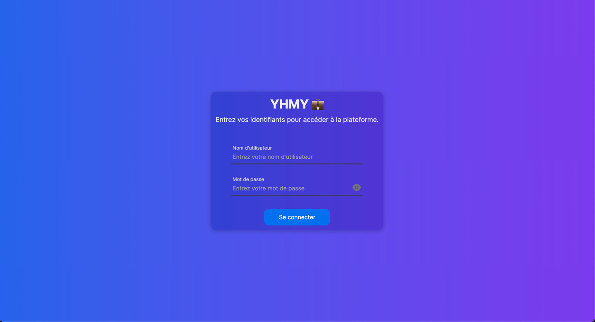
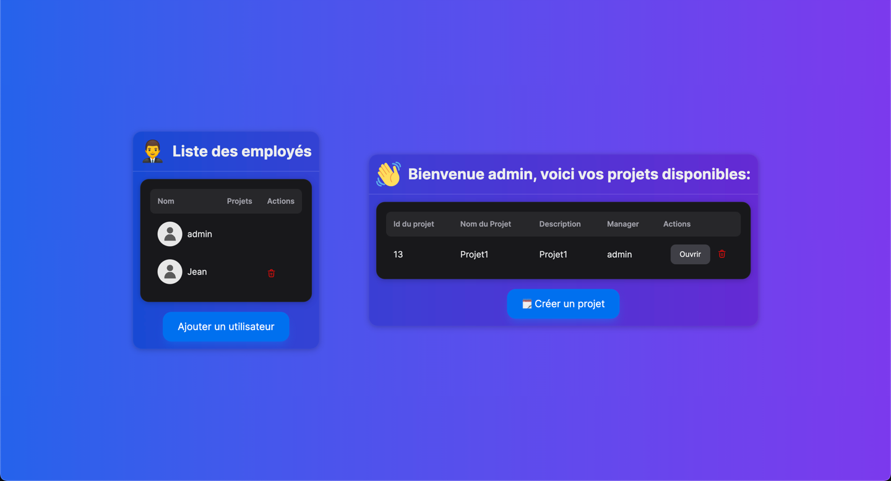
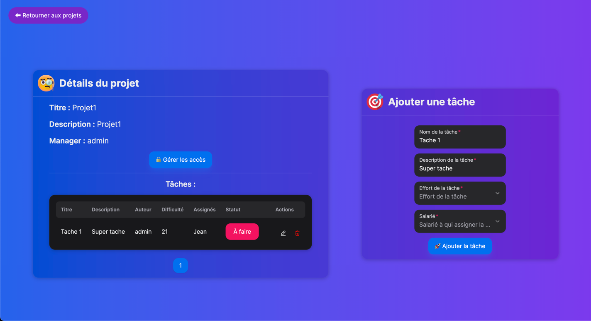

# YHMY 💼
Application de gestion de projet.


### Stack utilisée :

Framework global : Next.Js
 * Backend : 
   * Base de données : [SQLite](https://www.sqlite.org/) | Raisons : Léger, Hebergé en local, pas de configuration fastidieuse ✅
   * ORM : [Prisma](https://prisma.io/) | Raisons : Très simple d'utilisation et très bonne compatibilité avec React ✅
 * Frontend :
   * Librairie UI : [NextUI](https://nextui.org/) | Raisons : Nombreux composants modernes, multi-usages et paramétrables ✅


### Procédure de démarrage :
Pour commencer, ouvrez un terminal et clonez le projet avec la commande suivante :

```bash
git clone https://github.com/whiteshrt/YHMY
cd YHMY
npm install
```

Ensuite tapez la commande suivante pour lancer le serveur de développement :
```bash
npm run dev
```

Ouvrez ensuite le lien [http://localhost:3000](http://localhost:3000) avec votre navigateur pour voir le résultat.

Vous pouvez également visualiser la base de données en temps réel en tapant cette commande dans un autre terminal :
```bash
prisma studio
```
Ouvrez ensuite le lien [http://localhost:5000](http://localhost:3000) avec votre navigateur pour y accéder.

### Mode d'emploi
#### 1. Page de connexion :


Voici les deux profils tests auxquels vous pouvez vous connecter :
   * Nom d'utilisateur : admin
   * Mot de passe : admin


   * Nom d'utilidateur : Jean
   * Mot de passe : Azerty1234*
   
Le profil "admin" a le pouvoir d'ajouter de nouveaux employés et les supprimer. Il a également le pouvoir sur tous les projets et tâches.

#### 2. Page d'accueil :
Voici l'interface que vous verrez si vous vous connectez en tant qu'administrateur. Si vous êtes seulement employé, vous ne verrez que la partie de droite.

P.S : Tous les mots de passes enregistrés sont cryptés   à l'aide de la librairie bcrypt et décryptés uniquement lors de la connexion.




Pour ouvrir un projet, cliquez simplement sur ouvrir.

Lorsque vous créez un projet, vous êtes considérés d'office comme le manager de celui-ci.

#### 3. Page projet
Voici l'interface des projets.
N'importe qui ayant accès à un projet peut y créer des tâches.



Si vous êtes manager, vous aurez également accès à un bouton "Gérer les accès" pour configurer les accès des employés ayant accès a votre projet.

Si vous avez les droits sur une tâche, vous pouvez églement modifier son status (A faire, En Cours ou Fait).

Enjoy !
